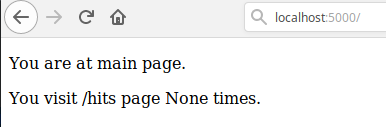
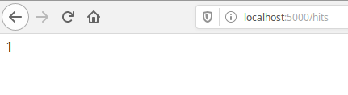
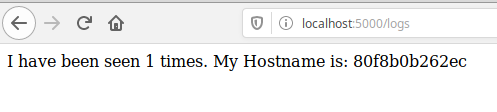
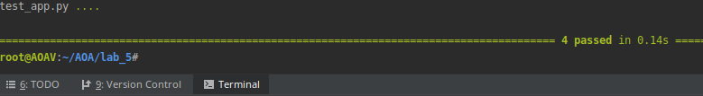

##### 1. Створив папки my_app & tests. Скопіював відповідні файли у свій репозитрій. Файли requirements.txt містять назви білбліотек використаних у проекті.
##### 2. Запускаємо проект і... І бачимо помилку шукаєм необхідні інструкції з дядьком гуглом виконуємо їх. Запускаємо... Ура успіх!
##### Бракує logs/app.log Допоможемо і створимо папку logs!
##### 3. Видаляємо файли. І створюємо Dockerfile.app Dockerfile.tests Makefile
##### 4. Директиви Makefile
##### - STATES := app tests змінні яким динамічно присвоюються значення
##### - REPO := tarasshynkler/firstrepos:lab5 назва репозиторію на Docker Hub
##### - .PHONY: $(STATES) створює несправжні цілі
##### - run виконує команди
##### - docker-prune очищення ресурсів
##### 5. Виконуємо білд імеджів make app, make tests Запускаємо їх. Тести пройшли успішно

##### 6. Чистимо ресурси Docker make docker-prune
##### 7. Додаємо дериктиву push і команди. Виконуємо